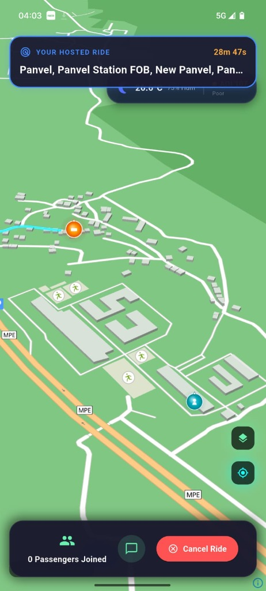
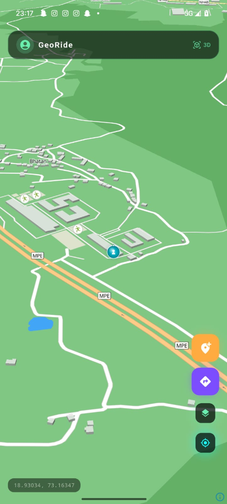

# <p align="center"></p>
# <p align="center">GeoRide: The Sci-Fi Ride-Sharing Experience</p>

<p align="center">
  <strong>Transforming daily commutes into immersive, Pokemon GO-inspired adventures with high-fidelity real-time navigation.</strong>
</p>

<p align="center">
  <a href="https://flutter.dev"></a>
  <a href="https://firebase.google.com"></a>
  <a href="https://dart.dev"></a>
  <a href="https://maplibre.org"></a>
  
</p>

---

## 🌌 Introduction

**GeoRide** is not just another ride-sharing app. It is a high-fidelity navigation platform designed with a futuristic "Void Dark" tactical aesthetic. Inspired by the interactive mechanics of Pokemon GO, GeoRide overlays a gamified, neon-lit interface onto the real world, turning every ride into a mission.

Whether you are a host sharing your journey or a passenger joining one, GeoRide provides a premium HUD (Heads-Up Display) experience that keeps you informed, safe, and immersed in your environment.

## 🚀 Key Features

### 🛠️ Immersive Tactical HUD
- **Glassmorphism Design**: A sleek, transparent UI that feels like an integrated cockpit.
- **Dynamic Ride State HUD**: Real-time tracking of distance, duration, and seat availability.
- **Neon Route Rendering**: Traveled paths fade into a dim glow, while the remaining path illuminates in high-contrast neon indigo/cyan.

### 📍 Advanced Navigation & Logistics
- **Traffic-Aware Pathfinding**: Powered by **OSRM**, path segments are color-coded based on real-time traffic density (Indigo for Clear, Orange for Moderate, Red for Heavy).
- **Photon Geocoding**: Lightning-fast destination search and coordinate resolution.
- **MapLibre GL Core**: High-performance vector rendering with custom sci-fi style layers.

### 🌬️ Environmental Intelligence
- **Real-time Weather & AQI**: Integrated tracking of local weather conditions (Night/Day, Temperature) and Air Quality Index (AQI) using **Open-Meteo**, adapting dynamically as you move.
- **Adaptive Positioning**: HUD elements intelligently shift to avoid overlapping during active rides.

### 🚗 Smart Ride Lifecycle
- **Synchronous Rating Phase**: A mandatory, dual-sided feedback system that triggers automatically upon arrival, ensuring community trust.
- **Atomic Transactions**: Firestore-backed ride management (join/leave/cancel) with robust concurrency handling.
- **Host-Passenger Sync**: Real-time location sharing and status updates across all connected clients.

## 📸 Visual Showcase

<p align="center">
  
  
</p>

## 🛠️ Technical Architecture

### Core Tech Stack
- **Frontend**: [Flutter](https://flutter.dev/) (3.x) with Custom Theme Engine.
- **Backend**: [Firebase](https://firebase.google.com/) (Authentication, Cloud Firestore, Realtime Database).
- **Mapping Engine**: [MapLibre GL](https://maplibre.org/) with custom Vector Style JSON.
- **Routing Engine**: [OSRM](https://project-osrm.org/) API (Open Source Routing Machine).
- **Environmental Data**: [Open-Meteo](https://open-meteo.com/) (Meteorological and AQI data).

### Logic Breakdown
- **Phase 9 (Path Logic)**: Real-time path segmentation and neon-glow rendering based on OSRM annotations.
- **Phase 10 (Rating Phase)**: A blocking state transition that forces a feedback loop between host and passengers before completing the ride lifecycle.

## 📦 Getting Started

### 1. Prerequisites
- [Flutter SDK](https://docs.flutter.dev/get-started/install) installed on your machine.
- A [Firebase Project](https://console.firebase.google.com/) with Firestore and Auth enabled.
- (Optional) A local OSRM instance or use the public demo server.

### 2. Installation
```bash
# Clone the repository
git clone https://github.com/SparshMishra09/GeoRide.git

# Navigate to project directory
cd georide

# Install dependencies
flutter pub get
```

### 3. Configuration
- **Firebase**: Download `google-services.json` (Android) and `GoogleService-Info.plist` (iOS) from your Firebase console and place them in `android/app/` and `ios/Runner/` respectively.
- **Assets**: The custom MapLibre style is located in `assets/style.json`. Ensure any custom tileserver URLs are configured there.

### 4. Running the App
```bash
# Launch on an emulator or physical device
flutter run --release
```

## 📂 Project Structure

```text
lib/
├── main.dart           # App entry point & Theme configuration
├── screens/            
│   └── home_screen.dart # Core logic (Ride state, HUD, Map integration)
├── services/           
│   ├── osrm_service.dart   # Pathfinding and traffic logic
│   └── weather_service.dart # AQI and Weather fetching
├── widgets/            
│   ├── hud_overlay.dart    # Tactical UI elements
│   └── rating_overlay.dart # Post-ride feedback system
└── theme/              
    └── app_theme.dart      # Custom "Void Dark" design tokens
```

## 🤝 Contributing

We welcome contributions from the community!
1. Fork the Project.
2. Create your Feature Branch (`git checkout -b feature/AmazingFeature`).
3. Commit your Changes (`git commit -m 'feat: add some amazing feature'`).
4. Push to the Branch (`git push origin feature/AmazingFeature`).
5. Open a Pull Request.

---

<p align="center">Built with 💙 by Sparsh Mishra and the GeoRide Community.</p>
<p align="center"><i>"The future of commuting is tactical."</i></p>

