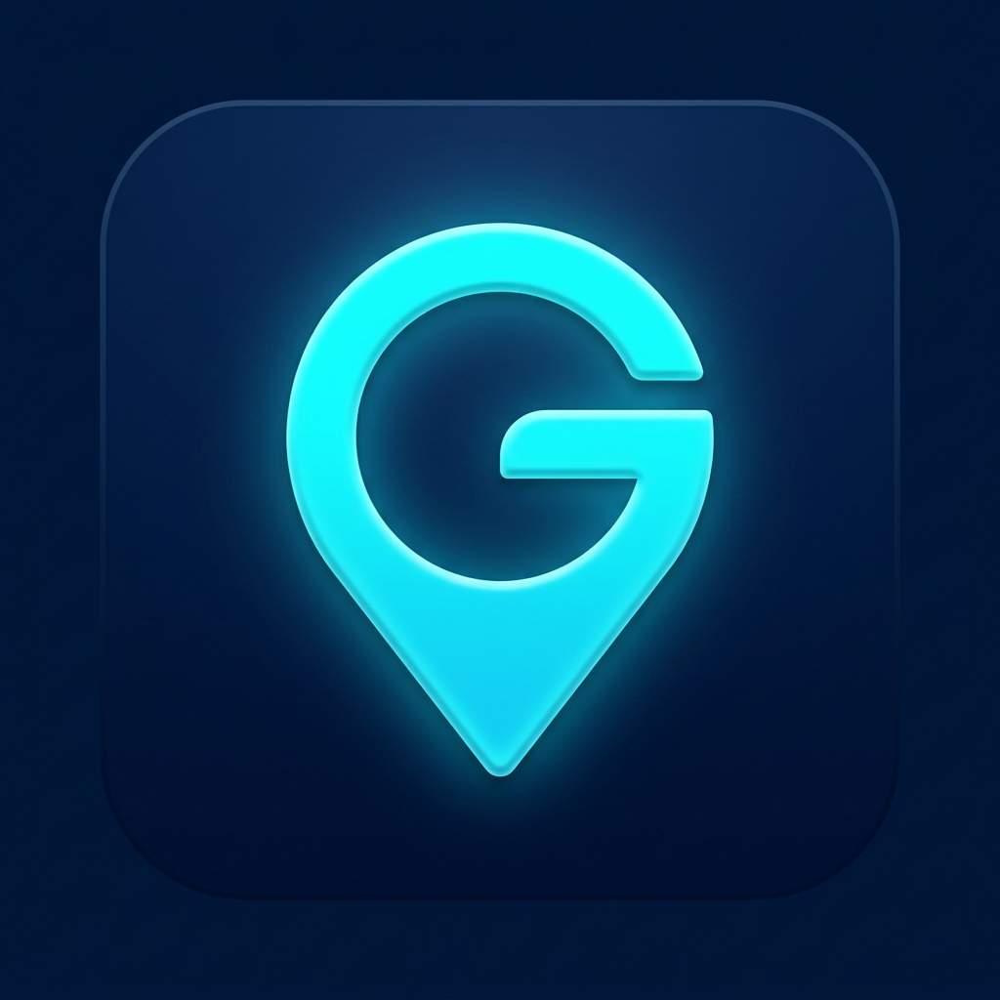
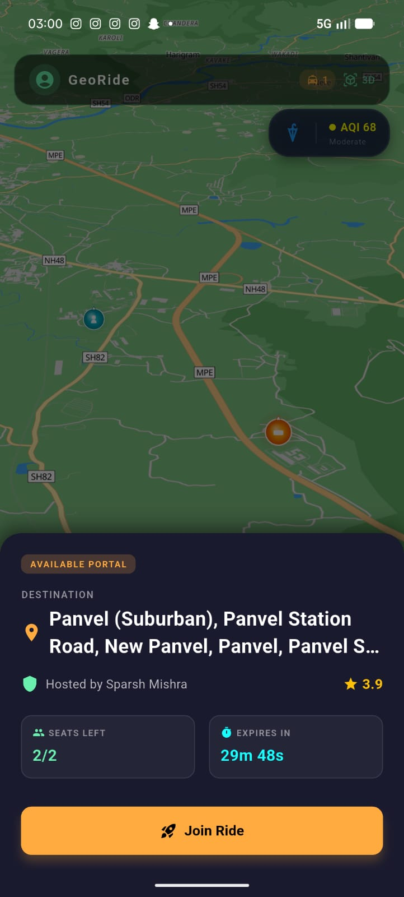
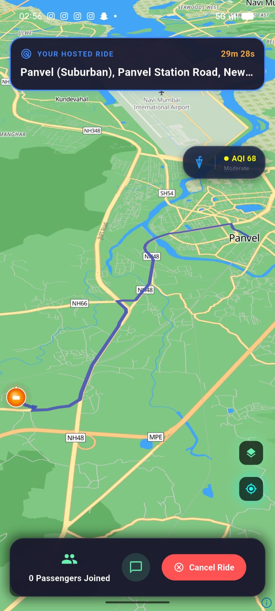
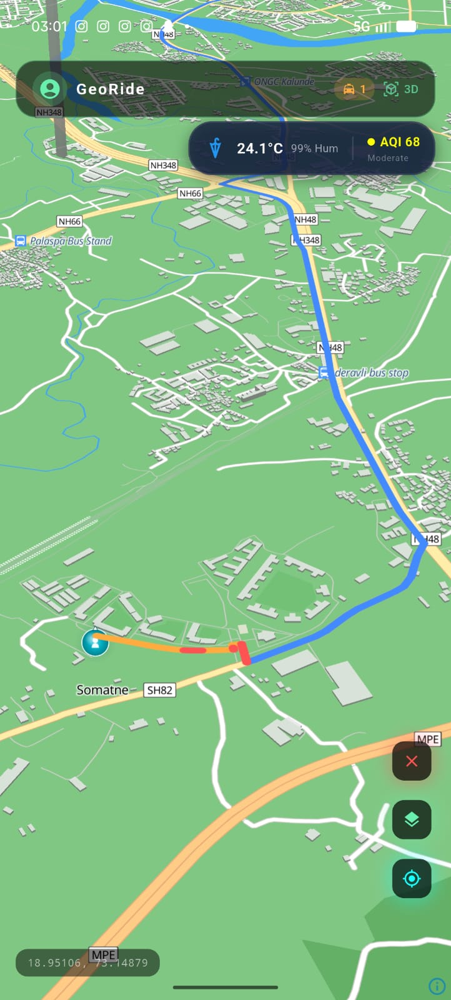
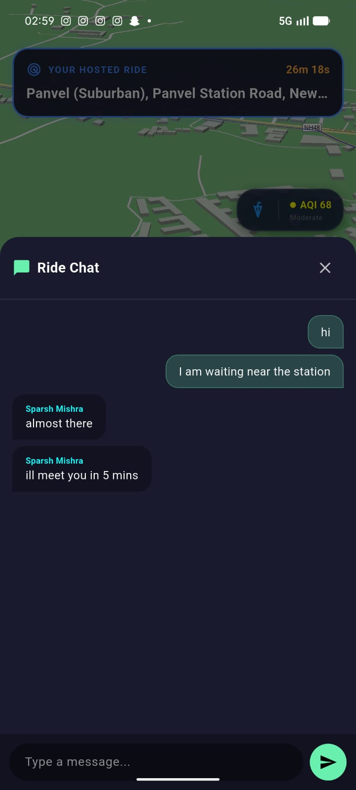
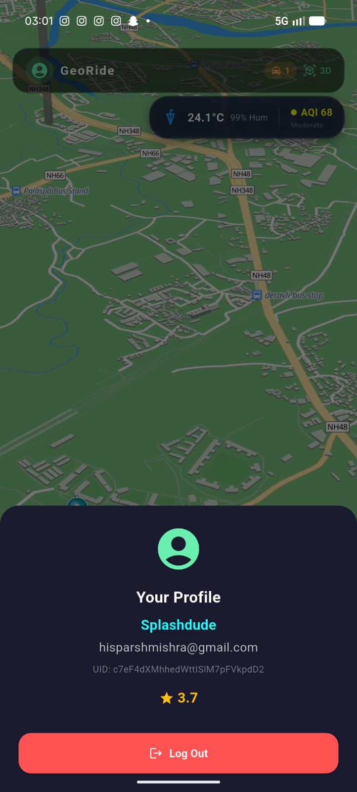

<p align="center">
  
</p>

<h1 align="center">GeoRide</h1>

<p align="center">
  <strong>Pokemon GO inspired real-time GPS ride-sharing app.</strong><br/>
  Host rides, join portals, navigate with live maps, and chat with your co-riders — all in real time.
</p>

<p align="center">
  <a href="https://github.com/SparshMishra09/GeoRide/releases/latest"></a>
  
  
  
  
  
</p>

---

## Table of Contents

- [Overview](#overview)
- [Screenshots](#screenshots)
- [Features](#features)
- [Tech Stack](#tech-stack)
- [Architecture](#architecture)
- [Getting Started](#getting-started)
- [Firebase Setup](#firebase-setup)
- [Roadmap](#roadmap)
- [License](#license)

---

## Overview

**GeoRide** lets you share rides in real time using an interactive 3D map. A host creates a ride portal at their location with a destination, seat count, and expiry timer. Nearby riders can discover and join the portal, then navigate to the pickup spot with live route guidance. Everyone's GPS position is tracked on the map so you always know where your co-riders are.

### How It Works

1. **Host a ride** — drop a portal on the map with your destination and available seats
2. **Join a ride** — tap an available portal on the map to see ride details and join
3. **Navigate** — get real-time turn-by-turn route to the pickup spot
4. **Chat** — communicate with your host/co-riders via in-ride chat
5. **Arrive** — proximity detection marks you as arrived when you reach the spot
6. **Rate** — safety rating system keeps the community trustworthy

---

## Screenshots

<p align="center">
  
  &nbsp;&nbsp;
  
  &nbsp;&nbsp;
  
</p>

<p align="center">
  
  &nbsp;&nbsp;
  
</p>

---

## Features

### Core
- **Real-time ride sharing** — host or join rides with live GPS tracking
- **Interactive 3D map** — MapLibre GL with Pokemon GO-style green terrain theme
- **Live passenger tracking** — see all co-riders move on the map in real time
- **In-ride chat** — Firestore-powered messaging between host and passengers
- **Proximity alerts** — automatic detection when you reach the pickup spot

### Map & Navigation
- **3D / 2D toggle** — switch between tilted 3D and flat 2D map views
- **Smooth avatar animation** — your position glides naturally across the map
- **Explore mode** — pan freely without auto-camera following, re-center with one tap
- **Route display** — live OSRM-powered route from your location to the portal
- **Glowing path** — host sees a neon route line to their destination

### Ride Management
- **Portal system** — visible map markers for active rides with seat/expiry info
- **Live countdown** — real-time expiry timer on ride cards
- **Seat tracking** — automatic seat decrement as passengers join
- **Auto-expiry** — rides automatically expire and clean up from Firestore
- **Cancel ride** — hosts can cancel their active ride

### Smart Features
- **Weather & AQI overlay** — live temperature, humidity, and air quality index
- **Solo trip mode** — navigate to any destination with traffic-colored route segments
- **Safety ratings** — star-based rating system for riders
- **GPS smoothing** — 3-sample averaging reduces position jitter
- **Camera debounce** — prevents janky map movement during GPS updates

---

## Tech Stack

| Layer | Technology |
|-------|-----------|
| **Framework** | Flutter 3.41 (Dart 3.11) |
| **Maps** | MapLibre GL 0.25 (OpenStreetMap tiles) |
| **Routing** | OSRM (Open Source Routing Machine) |
| **Weather** | Open-Meteo API (temperature, humidity, weather code) |
| **AQI** | WAQI (World Air Quality Index) API |
| **Auth** | Firebase Auth (email/password) |
| **Database** | Cloud Firestore (rides, chat, passenger locations, ratings) |
| **Location** | Geolocator (GPS streaming + smoothing) |
| **Permissions** | permission_handler |
| **Map Style** | OpenFreeMap Liberty (remixed to Pokemon GO theme) |

---

## Architecture

```
GeoRide/
├── lib/
│   ├── main.dart                  # App entry (Firebase init → AuthGate)
│   └── screens/
│       ├── auth_screen.dart       # Login / signup / password reset
│       └── home_screen.dart       # Map, portals, hosting, navigation, chat
│
│   ├── assets/
│   │   ├── icons/
│   │   │   └── app_icon.png           # App launcher icon
│   │   └── style.json                 # MapLibre GL style config
│
├── docs/
│   └── screenshots/               # App screenshots for README
│
├── android/                       # Android-specific config
├── ios/                           # iOS-specific config
└── pubspec.yaml                   # Dependencies + assets
```

### Key Design Decisions

- **Single-screen architecture** — the entire ride experience lives on one map screen with bottom sheets and modals
- **Inline models** — `SharingPoint` is defined directly in `home_screen.dart` to keep the codebase self-contained
- **Programmatic avatars** — player and portal markers are generated via `CustomPainter` at runtime (no image assets needed)
- **Firestore subcollections** — passenger locations and chat messages are stored under each ride document for easy scoping

---

## Getting Started

### Prerequisites
- Flutter 3.41+
- Firebase project with Auth + Firestore enabled
- Android SDK (min SDK 21)

### Install
```bash
git clone https://github.com/SparshMishra09/GeoRide.git
cd GeoRide
flutter pub get
flutter run
```

### Build Release APK
```bash
flutter build apk --release
```

---

## Firebase Setup

1. Create a Firebase project at [console.firebase.google.com](https://console.firebase.google.com/)
2. Add an Android app with package name `com.example.georide`
3. Enable **Email/Password** sign-in under Authentication
4. Create a **Cloud Firestore** database in production mode
5. Add security rules:

```
rules_version = '2';
service cloud.firestore {
  match /databases/{database}/documents {
    match /users/{userId} {
      allow read: if request.auth != null;
      allow write: if request.auth != null && request.auth.uid == userId;
    }
    match /sharing_points/{rideId} {
      allow read: if request.auth != null;
      allow create: if request.auth != null;
      allow update: if request.auth != null;
      match /messages/{msgId} {
        allow read, write: if request.auth != null;
      }
      match /passenger_locations/{uid} {
        allow read, write: if request.auth != null && request.auth.uid == uid;
      }
    }
  }
}
```

6. Download `google-services.json` → `android/app/google-services.json` (gitignored)

---

## Roadmap

- [ ] **Push notifications** — alert nearby riders when a portal is created
- [ ] **Ride history** — past trips with receipts and ratings
- [ ] **Multi-stop routes** — shared waypoints along a route
- [ ] **iOS support** — Apple Sign-In + App Store deployment
- [ ] **Driver verification** — license and vehicle document upload
- [ ] **Fare splitting** — automatic cost calculation per passenger
- [ ] **Dark / Light theme** — user-selectable map themes

---

## License

This project is proprietary software. All rights reserved.

© 2026 GeoRide. Developed by [Sparsh Mishra](https://github.com/SparshMishra09).

---

<p align="center">
  
</p>
<p align="center"><em>Share the ride. Share the adventure.</em></p>
